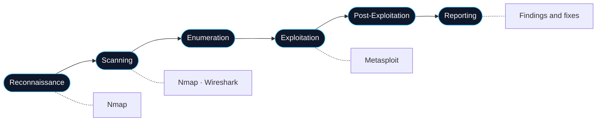
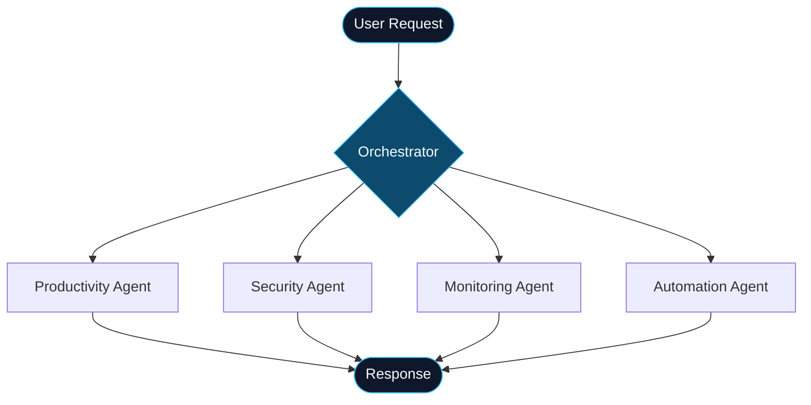

<div align="center">
<a href="https://github.com/Parth4465">
  
</a>

<br/><br/>
 


<br/><br/>
 

<a href="https://github.com/Parth4465?tab=followers">
  
</a>
</div>
---
 
## `> whoami`
 
```bash
parth@kali:~$ cat profile.txt
 
NAME        : Parth Khond
ROLE        : Computer Science & Engineering Student
COLLEGE     : PVGCET Nashik  (Class of 2027)
BACKGROUND  : Diploma in Computer Engineering, K.K. Wagh Polytechnic
EXPERIENCE  : Software Development Internship
SPECIALTY   : Cybersecurity · Penetration Testing · Ethical Hacking
BUILDS      : Web apps · Android apps · AI-driven security tools
STATUS      : Open to internships and entry-level roles
```
 
I like building software and then testing it the way an attacker would. My goal is to grow into a security role, starting in penetration testing and SOC operations, while keeping a strong development foundation.
 
---
 
## `> security --focus`
 
### Penetration testing workflow
 

 
### Security toolkit
 
| Domain | Tools | Used for |
|:---|:---|:---|
| Offensive | Kali Linux, Metasploit | Exploitation practice, lab environments |
| Recon and scanning | Nmap | Host discovery, port and service scanning |
| Traffic analysis | Wireshark | Packet inspection, protocol analysis |
| Detection | Snort | Intrusion detection and rule-based alerting |
| Automation | Python | Custom scripts, security agents |
 
### Skill map
 
```text
CYBERSECURITY
├── Offensive Security
│   ├── Penetration Testing
│   ├── Ethical Hacking
│   └── Exploitation (Metasploit)
├── Network Security
│   ├── Scanning and Enumeration (Nmap)
│   └── Packet Analysis (Wireshark)
├── Defensive Security
│   ├── Intrusion Detection (Snort)
│   └── Threat Detection and Response (Project Firebreak)
└── Security Automation
    └── AI Security Agents (AegisAI)
```
 
---
 
## `> ls projects/`
 
### AegisAI  ·  *In Development*
 
> A multi-agent AI system where specialized agents coordinate to handle productivity, cybersecurity, system monitoring, and task automation.
 
[](https://github.com/Parth4465/aegis-ai)
 
| Layer | Technology |
|:---|:---|
| AI | OpenAI API |
| Backend | Python |
| Architecture | Multi-agent system |
| Security | Cybersecurity agents |
 

 
---
 
### Project Firebreak  ·  *Cybersecurity*
 
> A security project built around detecting, analyzing, and responding to threats.
 
[](https://github.com/Parth4465/project-firebreak)
 
| Layer | Technology |
|:---|:---|
| Domain | Threat detection and response |
| Language | Python |
| Environment | Kali Linux |
| Tools | Git, GitHub, VS Code |
 
---
 
### Crime Record Management System
 
> A Flask and MySQL platform for FIR registration, criminal records, investigations, evidence uploads, PDF and QR reports, and crime analytics.
 
[](https://github.com/Parth4465/crime_record_web)
 
| Layer | Technology |
|:---|:---|
| Frontend | HTML, CSS |
| Backend | Python, Flask |
| Database | MySQL |
| Features | FIR, records, evidence, QR and PDF reports |
 
---
 
### Fuel Delivery System
 
> An online fuel delivery platform with Google Maps tracking, Razorpay payments, driver assignment, order history, and admin management.
 
[](https://github.com/Parth4465/fuel-delivery-system)
 
| Layer | Technology |
|:---|:---|
| Frontend | HTML, CSS, JavaScript |
| Backend | PHP |
| Database | MySQL |
| Integrations | Google Maps, Razorpay |
 
---
 
### Student Performance Analysis
 
> A data analysis project that evaluates academic performance, identifies learning patterns, and highlights where students can improve.
 
[](https://github.com/Parth4465/student-performance-analysis)
 
| Layer | Technology |
|:---|:---|
| Language | Python |
| Focus | Data analysis |
 
---
 
## `> stack --list`
 
<div align="center">
<table>
<thead><tr><th align="left">Category</th><th colspan="6" align="center">Technologies</th></tr></thead>
<tbody>
<tr><td><b>Languages</b></td><td align="center" width="110"><br/><sub><b>Python</b></sub></td><td align="center" width="110"><br/><sub><b>Java</b></sub></td><td align="center" width="110"><br/><sub><b>JavaScript</b></sub></td><td align="center" width="110"><br/><sub><b>C++</b></sub></td><td align="center" width="110"><br/><sub><b>PHP</b></sub></td><td align="center" width="110"><br/><sub><b>Kotlin</b></sub></td></tr>
<tr><td><b>Frontend</b></td><td align="center" width="110"><br/><sub><b>HTML</b></sub></td><td align="center" width="110"><br/><sub><b>CSS</b></sub></td><td align="center" width="110"><br/><sub><b>React</b></sub></td><td align="center" width="110"><br/><sub><b>Angular</b></sub></td><td></td><td></td></tr>
<tr><td><b>Backend</b></td><td align="center" width="110"><br/><sub><b>Node.js</b></sub></td><td align="center" width="110"><br/><sub><b>Spring</b></sub></td><td align="center" width="110"><br/><sub><b>Flask</b></sub></td><td align="center" width="110"><br/><sub><b>PHP</b></sub></td><td></td><td></td></tr>
<tr><td><b>Mobile</b></td><td align="center" width="110"><br/><sub><b>Android Studio</b></sub></td><td align="center" width="110"><br/><sub><b>Kotlin</b></sub></td><td align="center" width="110"><br/><sub><b>Java</b></sub></td><td></td><td></td><td></td></tr>
<tr><td><b>Databases</b></td><td align="center" width="110"><br/><sub><b>MySQL</b></sub></td><td align="center" width="110"><br/><sub><b>MongoDB</b></sub></td><td align="center" width="110"><br/><sub><b>Oracle</b></sub></td><td></td><td></td><td></td></tr>
<tr><td><b>Cloud and AI</b></td><td align="center" width="110"><br/><sub><b>AWS</b></sub></td><td align="center" width="110"><br/><sub><b>OpenAI API</b></sub></td><td></td><td></td><td></td><td></td></tr>
<tr><td><b>Security</b></td><td align="center" width="110"><br/><sub><b>Kali Linux</b></sub></td><td align="center" width="110"><br/><sub><b>Linux</b></sub></td><td align="center" width="110"><br/><sub><b>Nmap</b></sub></td><td align="center" width="110"><br/><sub><b>Wireshark</b></sub></td><td align="center" width="110"><br/><sub><b>Metasploit</b></sub></td><td align="center" width="110"><br/><sub><b>Snort</b></sub></td></tr>
<tr><td><b>Dev Tools</b></td><td align="center" width="110"><br/><sub><b>Git</b></sub></td><td align="center" width="110"><br/><sub><b>GitHub</b></sub></td><td align="center" width="110"><br/><sub><b>VS Code</b></sub></td><td></td><td></td><td></td></tr>
</tbody>
</table>
</div>
---
 
## `> git log --stats`
 
<div align="center">
<a href="https://github.com/Parth4465">
  
</a>
<a href="https://github.com/Parth4465">
  
</a>
<br/>
<a href="https://github.com/Parth4465">
  
</a>
<br/>

</div>
---
 
## `> contact --open`
 
I'm always happy to talk about security, software projects, or opportunities to learn on a real team.
 
<div align="center">
<a href="https://www.linkedin.com/in/parth-khond-7220b7385/">
  
</a>
<a href="mailto:parthkhond09@gmail.com">
  
</a>
<a href="https://github.com/Parth4465">
  
</a>
<br/><br/>
 
**Learn • Build • Secure**
 
</div>
<a href="https://github.com/Parth4465">
  
</a>
 
